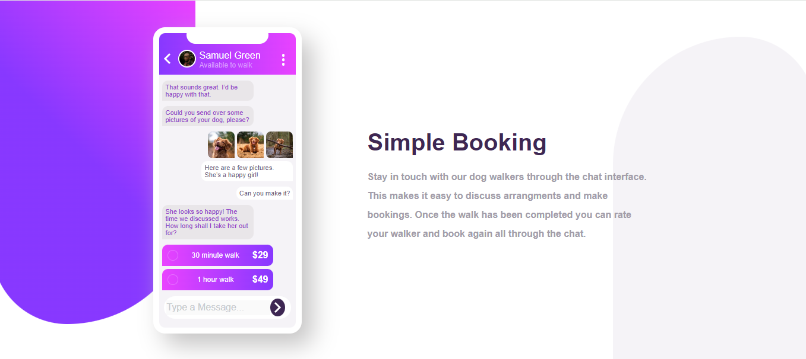

#  Chat app CSS illustration solution

This is a solution to the [Chat app CSS illustration challenge on Frontend Mentor](https://www.frontendmentor.io/challenges/chat-app-css-illustration-O5auMkFqY). Frontend Mentor challenges help you improve your coding skills by building realistic projects. 

## Table of contents

- [Overview](#overview)
  - [The challenge](#the-challenge)
  - [Screenshot](#screenshot)
  - [Links](#links)
- [My process](#my-process)
  - [Built with](#built-with)
  - [What I learned](#what-i-learned)
  - [Continued development](#continued-development)
  - [Useful resources](#useful-resources)
- [Author](#author)
- [Acknowledgments](#acknowledgments)

## Overview

### The challenge

Users should be able to:

- View the optimal layout for the component depending on their device's screen size
- **Bonus**: See the chat interface animate on the initial load

### Screenshot



### Links

- Solution URL: [Chat app Repository](https://github.com/blackcat-web/chat-app-css-illustration)
- Live Site URL: [Chat app Live](https://blackcat-web.github.io/chat-app-css-illustration/)

## My process

### Built with

- Semantic HTML5 markup
- CSS custom properties
- Flexbox
- CSS Grid
- Mobile-first workflow
- [React](https://reactjs.org/) - JS library
- [Next.js](https://nextjs.org/) - React framework
- [Styled Components](https://styled-components.com/) - For styles


### What I learned

In this project I learn a lot, I learn about more on working animation effects and  I use simple but good looking css animation effects

To see how you can add code snippets, see below:

```html
<p class="lorem0">Here are a few pictures. She’s a happy girl!</p>
```
```css
.lorem0{
  background: var(--white);
  width: 70%;
  border-radius: 10px;
  animation messageEffect var(--anime);
}
@keyframes messageEffect {
  from {
    transform: translate(300px);
  }
  to{
    transform: translate(0px);
  }
}
```
```
//No js is used in this project
```

### Continued development

proper responsive site and mobile first priority is the goal of my web development journey. I strongly believe that in future I have better understanding in [React](https://reactjs.org/), [Next.js](https://nextjs.org/) and I hope, I will not  doing coding from sratch. I will also focus on developing tools / frameworks like [angular](https://angular.io), [Django](https://djangoproject.com), [react.js](https://react.dev) and more

### Useful resources

- [W3schools](https://www.w3schools.com) - This site help me a lots while I am go deeper into web development and every time I stuck in some kind of layout problem I visit to [w3schools](https://www.w3schools.com/) and almost I get my solution.
- [Github](https://www.github.com) - Github is really a amazing platform where I use to push my repositories and it is be like **Mentos zinddagi** while using github.
- [CodePen](https://www.codepen.io) - CodePen is really cool place where I use to store my nonsense codes (._.) and It is really amazing site for me

## Author

- Frontend Mentor - [@blackcat-web](https://www.frontendmentor.io/profile/blackcat-web)
- CodePen - [@black-ninja](https://codepen.io/Black-ninja)
- Github - [@blackcat-web](https://www.github.com/blackcat-web/)

## Acknowledgments

I would Like to thank Myself and my anger because all my best works are the result of my angriness also I would like to Thank my **Lapy, Vs Code, Live Server** and at the last but not the least I would like to thanks my **Smart idiot box** my Phone.


